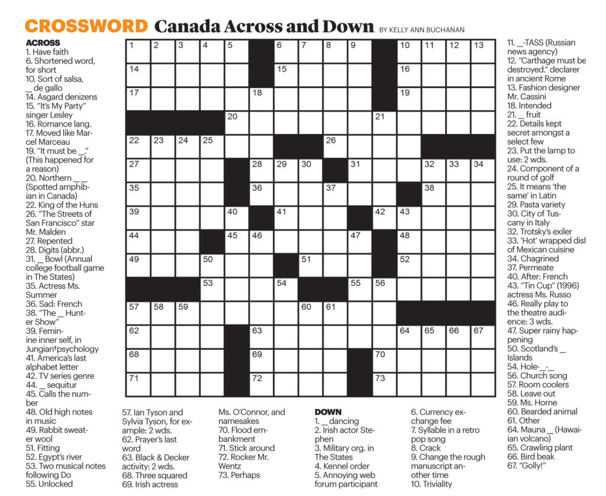

= *Канадский кроссворд*

Проект посвящен разработке консольной программы с псевдографическим интерфейсом, позволяющей создавать и разгадывать канадский кроссворд.

== Модули

- include::modules_descriptions/crossword_generator.adoc[Модуль взаимодействия с пользователем]

- include::modules_descriptions/user_features.adoc[Модуль генерации кроссворда]